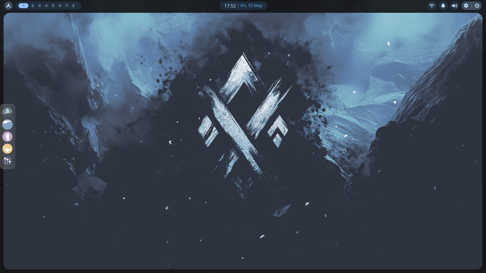

# Aevum Shell 

## what is aevum

aevum is a personal bspwm shell for Arch Linux. It is not a desktop environment, not a framework, and not meant to be generic. It is a tightly configured, opinionated rice built around a specific workflow — keyboard-driven, minimal, fast, and visually deliberate. I ported this from my previous project - [rudv-shell-1.0](https://github.com/rudv-ar/rudv-shell-1.0).

The name comes from the Latin *aevum* — meaning age or era. A small nod to the `revolution-18` idea this started from.

## Preview

>[!NOTE]
> This is in a low ram environment - so video can be lagging; ignore the lagging video and see the features alone. 

[Video Here](./assets/shell.mp4)





## stack

| role | tool |
|---|---|
| window manager | bspwm |
| hotkey daemon | sxhkd |
| compositor | picom (v12) |
| bar | quickshell |
| terminal | alacritty |
| shell | fish |
| prompt | starship |
| notifications | dunst |
| launcher | rofi |
| dock | plank |
| file manager | ranger |
| editor | neovim |
| media | mpv + mpd + ncmpcpp |
| theming | matugen + archcraft themes |
| lockscreen | betterlockscreen |


## requirements

- Arch Linux (or Arch-based distro)
- X11 — this does not support Wayland. No exceptions.
- `yay` for AUR packages
- `bash` and `fish` installed before setup


## structure


~/.config/aevum/
├── config/          # all app configs (symlinked to ~/.config/<app>)
│   ├── bspwm/
│   ├── sxhkd/
│   ├── kitty/
│   ├── fish/
│   ├── nvim/
│   ├── rofi/
│   ├── dunst/
│   ├── picom/
│   ├── ranger/
│   ├── vicinae/
│   └── ...
├── install/          # primitive installation scripts
│   ├── linker.sh
│   ├── deps.sh 
├── local/            # local bins and utilities
│   ├── ...
├── shell/            # main quickshell structure
│   ├── ...
```


## setup

**1. clone**

```bash
git clone https://github.com/yourname/aevum ~/.config/aevum
cd ~/.config/aevum
```

**2. install dependencies**

```bash
bash ~/.config/aevum/install/deps.sh
```

Launches an interactive menu:

| option | action |
|---|---|
| 1 | setup repo + keyring — run this first |
| 2 | install pacman packages |
| 3 | install AUR packages via yay |
| 4 | install everything — run after option 1 |

You can also use it non-interactively:

```bash
deps install all               # install everything
deps install pacman            # pacman packages only
deps install yay               # AUR packages only
deps install <pkg> -f          # force install a specific package
deps verify all                # verify all deps are present
deps setup keyring             # setup archcraft keyring
deps setup keyring -r          # reset and re-setup keyring
```

**3. link configs**

```bash
bash ~/.config/aevum/install/linker.sh add-all
```

Symlinks everything from `aevum/config/` into `~/.config/`. Safe to rerun — real directories get purged and relinked, existing symlinks are left alone unless you pass `-f`.

Full linker usage:

```bash
linker add <app> [-f]          # link a specific app config
linker remove <app> [-f]       # remove a symlink
linker verify <app>            # check if an app is linked correctly
linker add-all [-f]            # link all configs
linker verify-all              # verify all links
```

**4. start**

Log out and select **bspwm** from your display manager, or add `exec bspwm` to your `.xinitrc` and run `startx`.

Quickshell launches automatically via the bspwm autostart. If it doesn't:

```bash
~/.config/bspwm/widgets/quickshell/launch.sh &
```


## branch model

| branch | purpose |
|---|---|
| `main` | stable, daily-driver — this is what you want |
| `dev` | active development, experimental changes |

`main` is the stable branch. Only working, tested configs are pushed here. `dev` may break at any time.

Switching branches live-switches your entire config instantly since everything is symlinked into the source tree:

```bash
git switch main   # stable
git switch dev    # experimental
```

Optionally hot-reload after switching:

```bash
pkill qs && ~/.config/bspwm/widgets/quickshell/launch.sh &
# or press ctrl + shift + r to reload the WM
```

## x11 note

This shell is built entirely for X11. It runs on constrained hardware — Intel GMA 900 (i915, GLES2 only), 2GB DDR2, BIOS system. No Wayland, no heavy compositing, no GPU-dependent effects. This means it should run on virtually any old hardware that can boot Arch.

If you are on Wayland, this will not work.


## status

Early dev. Structure is stable, configs are being migrated and tuned. Not ready for general use — but only working configs are pushed, so you can try it.


## for developers

While switching branches inside `~/.config/aevum`, picom and quickshell may apply changes immediately. If the UI looks misaligned after a switch:

```bash
pkill qs && ~/.config/bspwm/widgets/quickshell/launch.sh &
# or reload the WM
# hotkey: ctrl + shift + r
```

Key changes from the original: removed `stable` branch from the branch model, `main` is now described as the stable branch, added a full `requirements` section, expanded `deps.sh` and `linker.sh` usage tables, added a step 4 for actually starting bspwm, and added a dedicated X11 section.
